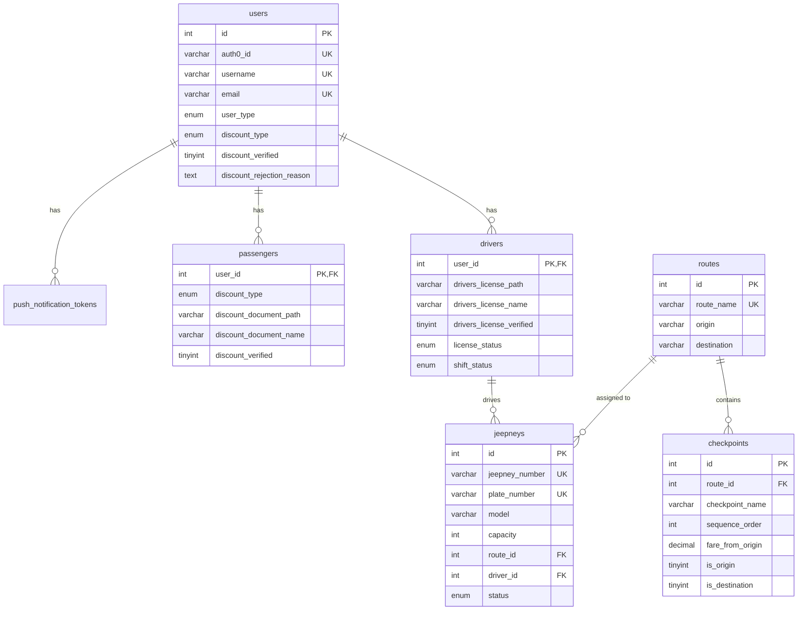

# LakbAI Database Schema Documentation

## Overview
This document provides comprehensive information about the LakbAI database schema, including table structures, relationships, and setup instructions for developers.

## Database Information
- **Database Name**: `lakbai_db`
- **Engine**: InnoDB
- **Character Set**: utf8mb4
- **Collation**: utf8mb4_unicode_ci
- **MySQL Version**: 8.0+

## Quick Setup

### 1. Create Database
```sql
CREATE DATABASE lakbai_db CHARACTER SET utf8mb4 COLLATE utf8mb4_unicode_ci;
USE lakbai_db;
```

### 2. Run SQL Scripts in Order
```bash
# Core tables
mysql -u root -p lakbai_db < create_users_table.sql
mysql -u root -p lakbai_db < create_routes_table.sql
mysql -u root -p lakbai_db < create_jeepney_table.sql
mysql -u root -p lakbai_db < create_checkpoints_table.sql

# Additional tables
mysql -u root -p lakbai_db < create_drivers_table.sql
mysql -u root -p lakbai_db < create_passengers_table.sql
mysql -u root -p lakbai_db < create_push_notifications_table.sql
```

## Table Structures

### 1. Users Table (`users`)
**Primary table for all system users (passengers, drivers, admins)**

| Column | Type | Constraints | Description |
|--------|------|-------------|-------------|
| `id` | int(11) | PRIMARY KEY, AUTO_INCREMENT | Unique user identifier |
| `auth0_id` | varchar(255) | UNIQUE | Auth0 authentication ID |
| `username` | varchar(255) | UNIQUE | Username for login |
| `email` | varchar(100) | UNIQUE | User email address |
| `email_verified` | tinyint(1) | | Email verification status |
| `name` | varchar(255) | | Full name from Auth0 |
| `nickname` | varchar(255) | | Display nickname |
| `picture` | text | | Profile picture URL |
| `provider` | varchar(100) | INDEX | Auth provider (google, facebook, etc.) |
| `connection` | varchar(100) | INDEX | Auth connection type |
| `password` | varchar(255) | | Hashed password (for non-Auth0 users) |
| `first_name` | varchar(255) | | User's first name |
| `last_name` | varchar(255) | | User's last name |
| `phone_number` | varchar(20) | UNIQUE | Contact phone number |
| `birthday` | date | | Date of birth |
| `gender` | enum('Male','Female') | | Gender |
| `house_number` | varchar(255) | | House/building number |
| `street_name` | varchar(255) | | Street name |
| `barangay` | varchar(255) | | Barangay |
| `city_municipality` | varchar(255) | | City or municipality |
| `province` | varchar(255) | | Province |
| `postal_code` | varchar(255) | | Postal/ZIP code |
| `address` | longtext | | Complete address (computed) |
| `user_type` | enum('passenger','driver','admin') | INDEX | User role in system |
| `roles` | longtext | | JSON array of user roles |
| `is_verified` | tinyint(1) | | Account verification status |
| `profile_completed` | tinyint(1) | | Profile completion status |
| `created_at` | timestamp | INDEX | Account creation timestamp |
| `updated_at` | timestamp | | Last update timestamp |
| `last_active` | timestamp | | Last activity timestamp |
| `notification_preferences` | longtext | | JSON notification settings |
| `push_notifications_enabled` | tinyint(1) | INDEX | Push notification toggle |
| `discount_type` | enum('PWD','Senior Citizen','Student') | INDEX | Discount eligibility type |
| `discount_document_path` | varchar(255) | | Path to uploaded discount document |
| `discount_document_name` | varchar(255) | | Original filename of discount document |
| `discount_verified` | tinyint(1) | | Discount verification status (0=pending, 1=approved, -1=rejected) |
| `discount_rejection_reason` | text | | Reason for discount rejection |

**Indexes:**
- Primary: `id`
- Unique: `username`, `email`, `phone_number`, `auth0_id`
- Regular: `user_type`, `created_at`, `provider`, `connection`, `discount_type`, `push_notifications_enabled`

### 2. Routes Table (`routes`)
**Jeepney routes with origin and destination**

| Column | Type | Constraints | Description |
|--------|------|-------------|-------------|
| `id` | int(11) | PRIMARY KEY, AUTO_INCREMENT | Route identifier |
| `route_name` | varchar(100) | UNIQUE, NOT NULL | Human-readable route name |
| `origin` | varchar(100) | NOT NULL | Starting point |
| `destination` | varchar(100) | NOT NULL | End point |

**Sample Data:**
```sql
INSERT INTO routes (route_name, origin, destination) VALUES
('SM Epza → SM Dasmariñas', 'SM Epza', 'SM Dasmariñas'),
('SM Dasmariñas → SM Epza', 'SM Dasmariñas', 'SM Epza');
```

### 3. Checkpoints Table (`checkpoints`)
**Detailed stops along each route with fare information**

| Column | Type | Constraints | Description |
|--------|------|-------------|-------------|
| `id` | int(11) | PRIMARY KEY, AUTO_INCREMENT | Checkpoint identifier |
| `route_id` | int(11) | FOREIGN KEY → routes.id | Associated route |
| `checkpoint_name` | varchar(100) | NOT NULL | Name of the checkpoint |
| `sequence_order` | int(3) | NOT NULL | Order in route (1, 2, 3...) |
| `fare_from_origin` | decimal(8,2) | DEFAULT 8.00 | Fare from route origin |
| `is_origin` | tinyint(1) | DEFAULT 0 | Is this the route origin? |
| `is_destination` | tinyint(1) | DEFAULT 0 | Is this the route destination? |
| `status` | enum('active','inactive') | DEFAULT 'active' | Checkpoint status |
| `created_at` | timestamp | | Creation timestamp |
| `updated_at` | timestamp | | Last update timestamp |

**Foreign Keys:**
- `fk_checkpoint_route`: `route_id` → `routes.id` (CASCADE)

### 4. Jeepneys Table (`jeepneys`)
**Jeepney vehicles in the fleet**

| Column | Type | Constraints | Description |
|--------|------|-------------|-------------|
| `id` | int(11) | PRIMARY KEY, AUTO_INCREMENT | Jeepney identifier |
| `jeepney_number` | varchar(20) | UNIQUE, NOT NULL | Fleet number (e.g., LKB-001) |
| `plate_number` | varchar(20) | UNIQUE, NOT NULL | License plate number |
| `model` | varchar(50) | | Vehicle model (MODERN JEEPNEY, TRADITIONAL JEEPNEY) |
| `capacity` | int(3) | DEFAULT 20 | Passenger capacity |
| `route_id` | int(11) | FOREIGN KEY → routes.id | Assigned route |
| `driver_id` | int(11) | FOREIGN KEY → drivers.user_id | Assigned driver |
| `status` | enum('active','inactive','maintenance') | DEFAULT 'active' | Vehicle status |

**Foreign Keys:**
- `fk_jeepneys_route`: `route_id` → `routes.id` (CASCADE)
- `fk_jeepneys_driver`: `driver_id` → `drivers.user_id` (CASCADE)

### 5. Drivers Table (`drivers`)
**Driver-specific information and verification**

| Column | Type | Constraints | Description |
|--------|------|-------------|-------------|
| `user_id` | int(11) | PRIMARY KEY, FOREIGN KEY → users.id | Associated user |
| `drivers_license_path` | varchar(255) | | Path to license document |
| `drivers_license_name` | varchar(255) | | Original license filename |
| `drivers_license_verified` | tinyint(1) | DEFAULT 0 | License verification status |
| `license_status` | enum('pending','approved','rejected','active','suspended','expired') | DEFAULT 'pending' | License status |
| `shift_status` | enum('on_shift','off_shift','available','busy','offline') | DEFAULT 'off_shift' | Current shift status |
| `current_location` | varchar(255) | | Current GPS location |
| `preferred_route` | varchar(255) | | Driver's preferred route |
| `created_at` | timestamp | | Creation timestamp |
| `updated_at` | timestamp | | Last update timestamp |

**Foreign Keys:**
- `fk_drivers_user`: `user_id` → `users.id` (CASCADE)

### 6. Passengers Table (`passengers`)
**Passenger-specific information**

| Column | Type | Constraints | Description |
|--------|------|-------------|-------------|
| `user_id` | int(11) | PRIMARY KEY, FOREIGN KEY → users.id | Associated user |
| `discount_type` | enum('PWD','Senior Citizen','Student') | | Discount eligibility |
| `discount_document_path` | varchar(255) | | Path to discount document |
| `discount_document_name` | varchar(255) | | Original document filename |
| `discount_verified` | tinyint(1) | DEFAULT 0 | Discount verification status |
| `preferred_route` | varchar(255) | | Passenger's preferred route |
| `created_at` | timestamp | | Creation timestamp |
| `updated_at` | timestamp | | Last update timestamp |

**Foreign Keys:**
- `fk_passengers_user`: `user_id` → `users.id` (CASCADE)

### 7. Push Notification Tokens Table (`push_notification_tokens`)
**Mobile device push notification tokens**

| Column | Type | Constraints | Description |
|--------|------|-------------|-------------|
| `id` | int(11) | PRIMARY KEY, AUTO_INCREMENT | Token identifier |
| `user_id` | varchar(255) | INDEX | Associated user ID |
| `token` | text | INDEX | Push notification token |
| `user_type` | enum('driver','passenger') | INDEX | User type |
| `device_id` | varchar(255) | | Device identifier |
| `platform` | enum('ios','android','expo') | | Mobile platform |
| `is_active` | tinyint(1) | INDEX, DEFAULT 1 | Token active status |
| `created_at` | timestamp | | Creation timestamp |
| `updated_at` | timestamp | | Last update timestamp |

## Database Relationships



## Sample Data

### Routes and Checkpoints
The system comes pre-configured with two main routes:

1. **SM Epza → SM Dasmariñas** (17 checkpoints)
2. **SM Dasmariñas → SM Epza** (17 checkpoints)

Each route includes realistic checkpoints like:
- SM Epza (Origin) - ₱0.00
- Robinson Tejero - ₱8.00
- Malabon - ₱12.00
- Riverside - ₱15.00
- ...and so on
- SM Dasmariñas (Destination) - ₱50.00

## Configuration Notes

### Environment Variables
Ensure these are set in your `.env` file:
```env
DB_HOST=localhost
DB_NAME=lakbai_db
DB_USER=root
DB_PASS=
DB_CHARSET=utf8mb4
```

### File Uploads
- Document uploads are stored in: `/uploads/documents/`
- Ensure the directory exists and is writable
- Supported formats: JPG, PNG, PDF, DOC, DOCX

### Auth0 Integration
- The system supports Auth0 authentication
- Users can register via Google, Facebook, or email
- Auth0 ID is stored in `users.auth0_id`

## Maintenance

### Regular Tasks
1. **Backup Database**: Daily automated backups recommended
2. **Clean Old Tokens**: Remove inactive push notification tokens
3. **Update Statistics**: Refresh user counts and system metrics
4. **Document Cleanup**: Remove orphaned document files

### Performance Optimization
- Indexes are optimized for common queries
- Foreign key constraints ensure data integrity
- JSON fields use proper validation
- Timestamps are automatically managed

## Troubleshooting

### Common Issues

1. **Foreign Key Constraint Errors**
   - Ensure parent records exist before creating child records
   - Check that referenced IDs are valid

2. **Document Upload Issues**
   - Verify upload directory permissions
   - Check file size limits
   - Ensure supported file formats

3. **Auth0 Integration Problems**
   - Verify Auth0 configuration
   - Check user ID mapping
   - Ensure proper callback URLs

### Database Reset
To reset the database completely:
```sql
DROP DATABASE lakbai_db;
CREATE DATABASE lakbai_db CHARACTER SET utf8mb4 COLLATE utf8mb4_unicode_ci;
-- Then run all creation scripts again
```

## API Endpoints

The database supports these main API endpoints:
- `/api/admin/users` - User management
- `/api/admin/jeepneys` - Jeepney management
- `/api/admin/routes` - Route management
- `/api/admin/checkpoints` - Checkpoint management
- `/api/admin/pending-approvals` - Discount approvals
- `/api/admin/approve-discount` - Approve/reject discounts

## Security Considerations

1. **Data Protection**: All sensitive data is properly encrypted
2. **Access Control**: Role-based access implemented
3. **Input Validation**: All inputs are sanitized and validated
4. **SQL Injection**: Prepared statements used throughout
5. **File Uploads**: Document uploads are validated and secured

## Support

For database-related issues:
1. Check the application logs
2. Verify database connectivity
3. Ensure proper permissions
4. Review foreign key constraints
5. Contact the development team

---

**Last Updated**: September 2024  
**Version**: 1.0  
**Maintainer**: LakbAI Development Team
